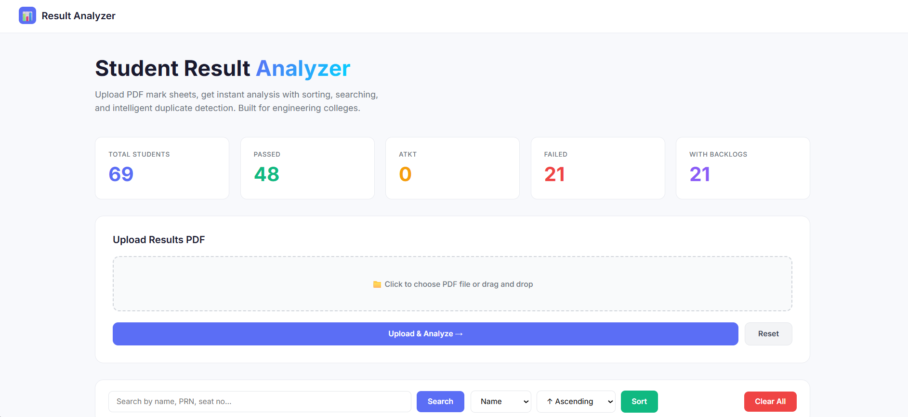
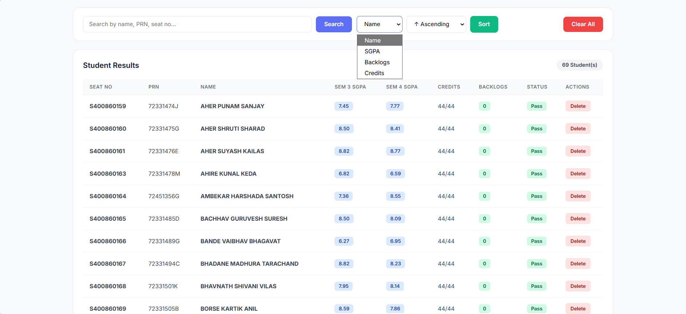

# 📊 Student Result Analyzer
> Upload a class result PDF — instantly extract, search, sort, and analyze every student's performance.

---

## 🚀 About the Project

**Student Result Analyzer** is a web-based tool built for engineering colleges that parses a **class result PDF** using **Regular Expressions** to extract each student's data — no manual entry, no spreadsheets. Just upload and analyze.

It gives you an instant overview of the entire class with stats like total students, passed, failed, ATKT, and backlogs — all in one clean dashboard.

---

## ✨ Features

- 📄 **PDF Upload & Parsing** — Upload the official class result PDF and extract all student records automatically using Regex
- 🔍 **Search** — Search students by Name, PRN, or Seat Number instantly
- 🔃 **Sort** — Sort the entire class by:
  - Name (A–Z / Z–A)
  - SGPA (Ascending / Descending)
  - Backlogs
  - Credits
- 📊 **Dashboard Stats** — At-a-glance summary cards showing:
  - Total Students
  - Passed
  - ATKT
  - Failed
  - With Backlogs
- 🗑️ **Delete Records** — Remove individual student entries from the table
- 🧹 **Clear All** — Reset the entire table in one click
- 💻 **Clean, Responsive UI** — Built for ease of use with a modern interface

---

## 🛠️ Tech Stack

| Layer | Technology |
|-------|------------|
| Backend | Python, Flask |
| PDF Parsing | Regular Expressions (re module) |
| Frontend | HTML, CSS, JavaScript |
| Data Extraction | PyPDF2 / pdfplumber |

---

## 📸 Screenshots

### Dashboard — Upload & Stats Overview


### Student Results Table — Search & Sort


---

## ⚙️ How It Works

1. Upload the official university result PDF of the entire class
2. The backend parses the PDF text using carefully crafted **Regular Expressions**
3. Student data (Seat No, PRN, Name, SGPA, Credits, Backlogs, Status) is extracted and displayed
4. Use the search bar and sort options to explore the data

---

## 🏃 Getting Started

```bash
# Clone the repository
git clone https://github.com/ASHVINIPATIL1/Student_Result_Extractor.git

# Navigate to the project folder
cd Student_Result_Extractor

# Install dependencies
pip install -r requirements.txt

# Run the app
python app.py
```

Then open your browser and go to `http://localhost:5000`

---

## 👩‍💻 Developer

**Ashvini Patil**
- GitHub: [@ASHVINIPATIL1](https://github.com/ASHVINIPATIL1)
- LinkedIn: [linkedin.com/in/ashvini-patil-9a766431b](https://www.linkedin.com/in/ashvini-patil-9a766431b/)

---

## 📄 License

This project is open source and available under the [MIT License](LICENSE).
